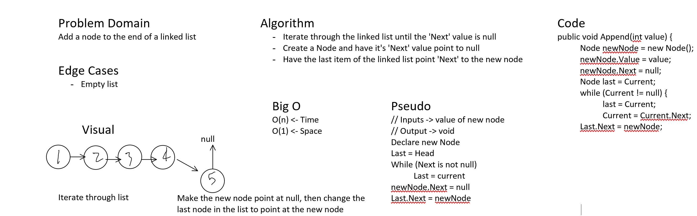
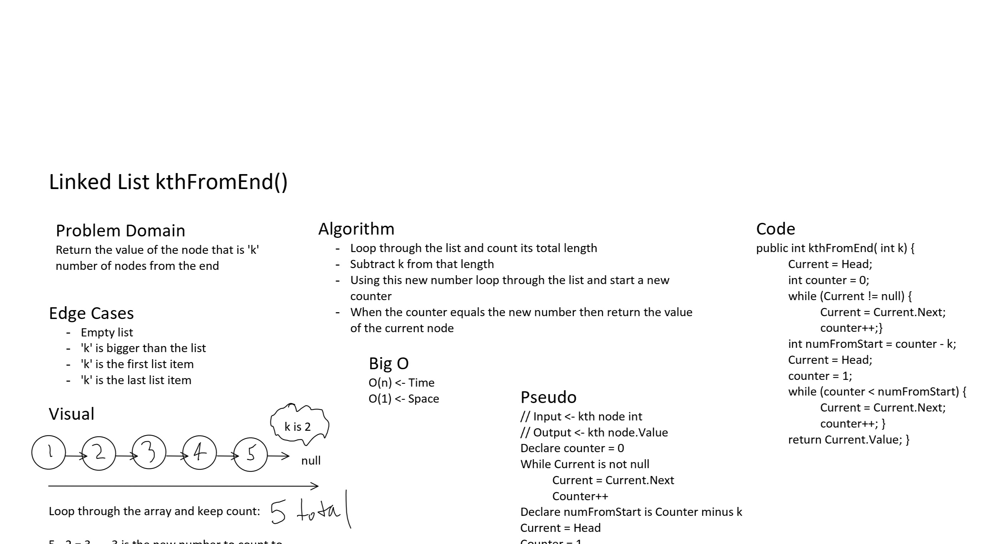

# Daily Code Challenge README Example

## Perfect Sequence
*Author: Bryant Davis*

---

### Problem Domain
***[Problem Domain for the Code Challenge]***

Create a Link Lists DLL.
Create the ability to insert before the first node, before middle of node, after last node and after middle node.
Create a method that will return the value of a node nth from the end.
Tests for edge cases such as negative numbers, numbers larger than linked lsits, same size as linked lists.

---

### Inputs and Expected Outputs

| Input | Expected Output |
| :----------- | :----------- |
| [1,3,2] | Yes |
| [2,99,100] | No |

---
### Whiteboard Visual

### Big O

| Time | Space |
| :----------- | :----------- |
| O(n) | O(n) |

---

### Change Log
***[The change log will list any changes made to the code base. This includes any changes from TA/Instructor feedback]***  
1.7: *All tests are passing.* 14 July 2020
1.6: *Created Tests and added a throw exception to the knthFromEnd() method* 14 July 2020
1.5: * Created knthFromEnd() method that returns a alue nth from the end* 14 July 2020
1.4: *Added all requred Tests and adjusted Methods to ensure passing* - 14 July 2020
1.3: *Added all the Methods InsertBefore(), InsertAfter() etc* - 14 July 2020
1.2: *Added whiteboard, still in need of the code* - 13 July 2020
1.1: *Amanda did it all and is stellar!!!!!* - 10 July 2020  

---

For more information on Markdown: https://www.markdownguide.org/cheat-sheet
