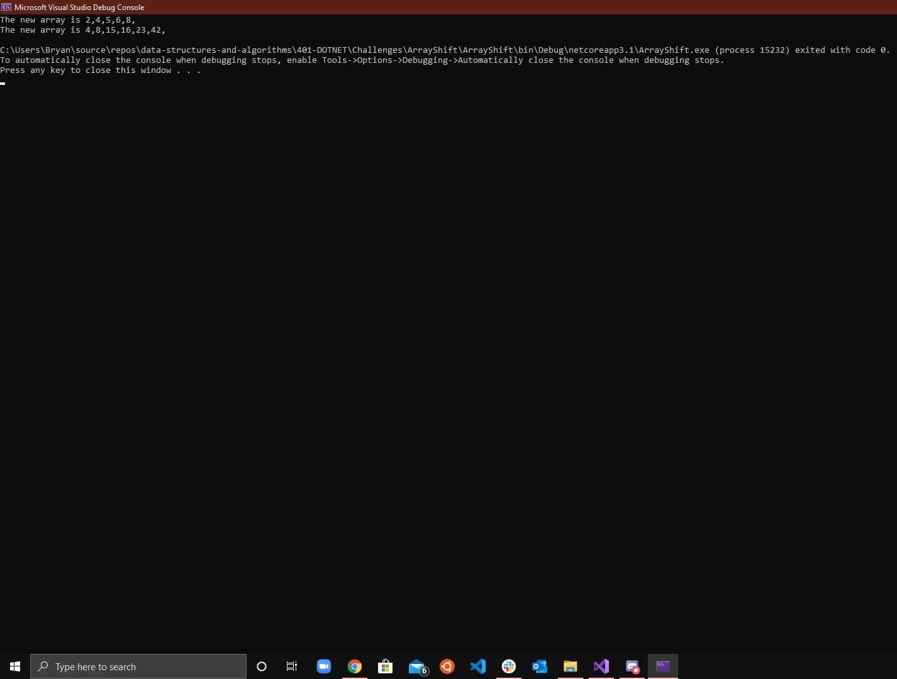

# Daily Code Challenge README Example

## Perfect Sequence
*Author: Bryant Davis*

---

### Problem Domain
***[Problem Domain for the Code Challenge]***

Given an array and a number return a new array with the number in the middle.

---

### Inputs and Expected Outputs

| Input | Expected Output |
|Int Array | Int Array

---

### Big O

| Time | Space |
| :----------- | :----------- |
| O(n) | O(n) |

---

### Whiteboard Visual
***[Your Whiteboard Image]***

---

### Change Log
***[The change log will list any changes made to the code base. This includes any changes from TA/Instructor feedback]***  
1.4 Method finished and both arrays pass
1.3: Refactored method to ensure 2nd array passes  
1.2 Inital method created, first array passes
1.1 Inital push

---

For more information on Markdown: https://www.markdownguide.org/cheat-sheet
