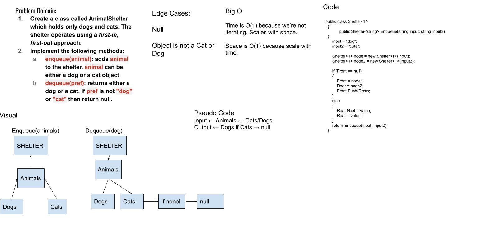

# Daily Code Challenge FIFOAnimalShelter

*Author: Bryant Davis*

---

### Problem Domain

Create a class called AnimalShelter which holds only dogs and cats. The shelter operates using a first-in, first-out approach.
Implement the following methods:
enqueue(animal): adds animal to the shelter. animal can be either a dog or a cat object.
dequeue(pref): returns either a dog or a cat. If pref is not "dog" or "cat" then return null.
---

### Inputs and Expected Outputs

| Input | Expected Output |
|Animal Object | Animal Object

---

### Big O

| Time | Space |
| :----------- | :----------- |
| O(1) | O(1) |

---

### Whiteboard Visual

---

### Change Log
1.1: *Created README, initial project and PseudoQueue Class. Added whiteboard to README and created the test project and added the main project as a dependency. initial push.* - July 20 2020 

---

