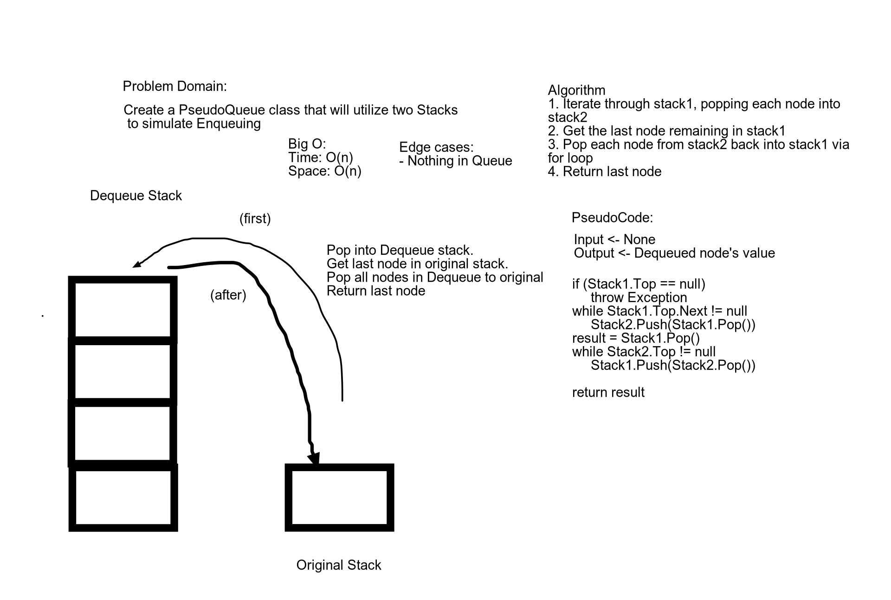

# Daily Code Challenge QueueWithStacks

*Author: Bryant Davis*

---

### Problem Domain
***[Problem Domain for the Code Challenge]***

Create a brand new PseudoQueue class. Do not use an existing Queue. Instead, this PseudoQueue class will implement our standard queue interface (the two methods listed below), but will internally only utilize 2 Stack objects. Ensure that you create your class with the following methods:

enqueue(value) which inserts value into the PseudoQueue, using a first-in, first-out approach.
dequeue() which extracts a value from the PseudoQueue, using a first-in, first-out approach.
The Stack instances have only push, pop, and peek methods. You should use your own Stack implementation. Instantiate these Stack objects in your PseudoQueue constructor.
---

### Inputs and Expected Outputs

| Input | Expected Output |
|Stack | Stack

---

### Big O

| Time | Space |
| :----------- | :----------- |
| O(1n) | O(1n) |

---

### Whiteboard Visual

unable to figure out why none of these images will load
<!-- 

 -->

---

### Change Log
1.1: *Created README, initial project and PseudoQueue Class. Added whiteboard to README and created the test project and added the main project as a dependency. initial push.* - July 20 2020 

---

