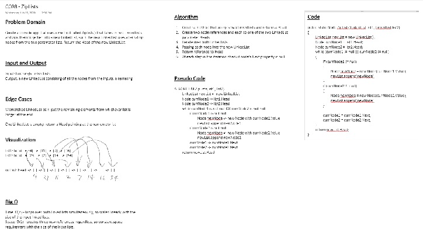

# LL Zip

## Challenge
Write a function called zipLists which takes two linked lists as arguments. Zip the two linked lists together into one so that the nodes alternate between the two lists and return a reference to the head of the zipped list. Try and keep additional space down to O(1). You have access to the Node class and all the properties on the Linked List class as well as the methods created in previous challenges.

## Approach & Efficiency
| Time | Space |
| :----------- | :----------- |
| O(1n) | O(1n) |

## Solution

## Test

 PASS  Challenges/llZip/zip.test.js
  Test Zip to ensure proper outcome
    ✓ Happy Path (3ms)
    ✓ First LL shorter than Second LL (6ms)
    ✓ Second LL shorter than First LL
    ✓ first LL empty (1ms)
    ✓ both LL empty

  console.log Challenges/llZip/zip.test.js:32
    LinkedList {
      head: Node { value: 15, next: Node { value: 5, next: null } },
      current: Node { value: 5, next: null }
    }

----------------------------|----------|----------|----------|----------|-------------------|
File                        |  % Stmts | % Branch |  % Funcs |  % Lines | Uncovered Line #s |
----------------------------|----------|----------|----------|----------|-------------------|
All files                   |    43.33 |    45.45 |       50 |    43.33 |                   |
 Challenges/llZip           |    90.48 |    92.86 |      100 |    90.48 |                   |
  ll-zip.js                 |    90.48 |    92.86 |      100 |    90.48 |             30,31 |
 data-structure/linked-list |    28.99 |    10.53 |    44.44 |    28.99 |                   |
  linked-list.js            |    25.76 |    11.11 |     37.5 |    25.76 |... 25,126,127,129 |
  node.js                   |      100 |        0 |      100 |      100 |                 4 |
----------------------------|----------|----------|----------|----------|-------------------|
Test Suites: 1 passed, 1 total
Tests:       5 passed, 5 total
Snapshots:   0 total
Time:        0.96s, estimated 1s
Ran all test suites matching /zip.test.js/i.