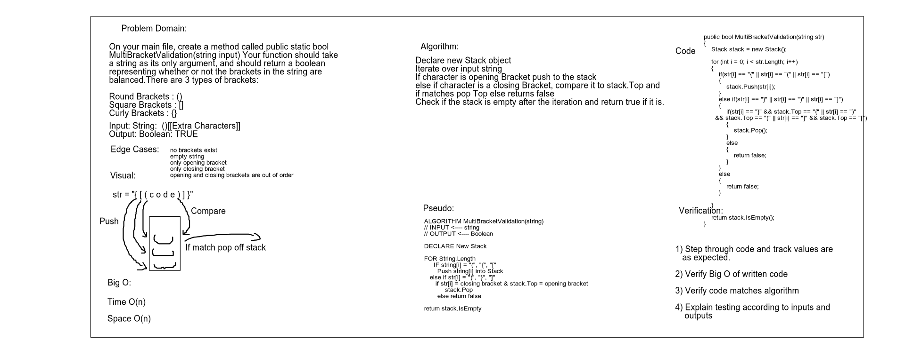

# Multi Bracket Validation

## Challenge
Your function should take a string as its only argument, and should return a boolean representing whether or not the brackets in the string are balanced. There are 3 types of brackets:

Round Brackets : ()
Square Brackets : []
Curly Brackets : {}

## Approach & Efficiency
| Time | Space |
| :----------- | :----------- |
| O(n) | O(n) |

## Solution


## Test

 ```
 > jest --coverage --verbose "multiBracketValidation.test.js"

 PASS  Challenges/multi-bracket-validation/multiBracketValidation.test.js
  validating proper bracket syntax
    ✓ 1st test case (2ms)
    ✓ 2nd test case
    ✓ 3rd test case (1ms)
    ✓ 4th test case
    ✓ 5th test case
    ✓ 6th test case
    ✓ 7th test case
    ✓ 8th test case

-------------------------------------|----------|----------|----------|----------|-------------------|
File                                 |  % Stmts | % Branch |  % Funcs |  % Lines | Uncovered Line #s |
-------------------------------------|----------|----------|----------|----------|-------------------|
All files                            |    86.21 |    82.61 |    83.33 |    86.21 |                   |
 Challenges/multi-bracket-validation |      100 |      100 |      100 |      100 |                   |
  multi-bracket-validation.js        |      100 |      100 |      100 |      100 |                   |
 data-structure/StacksandQueues      |    73.33 |       25 |       75 |    73.33 |                   |
  stack.js                           |    73.33 |       25 |       75 |    73.33 |       19,27,28,31 |
 data-structure/linked-list          |      100 |        0 |      100 |      100 |                   |
  node.js                            |      100 |        0 |      100 |      100 |                 4 |
-------------------------------------|----------|----------|----------|----------|-------------------|
Test Suites: 1 passed, 1 total
Tests:       8 passed, 8 total
Snapshots:   0 total
Time:        1.031s
Ran all test suites matching /multiBracketValidation.test.js/i.
```